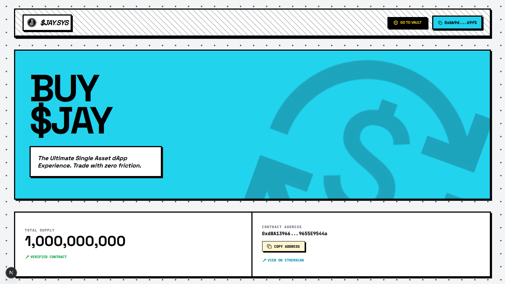
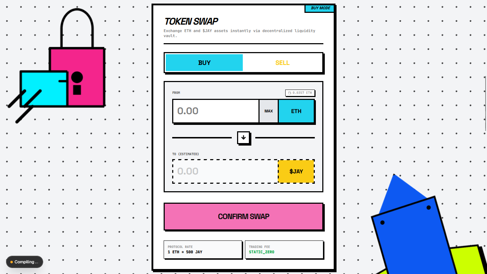
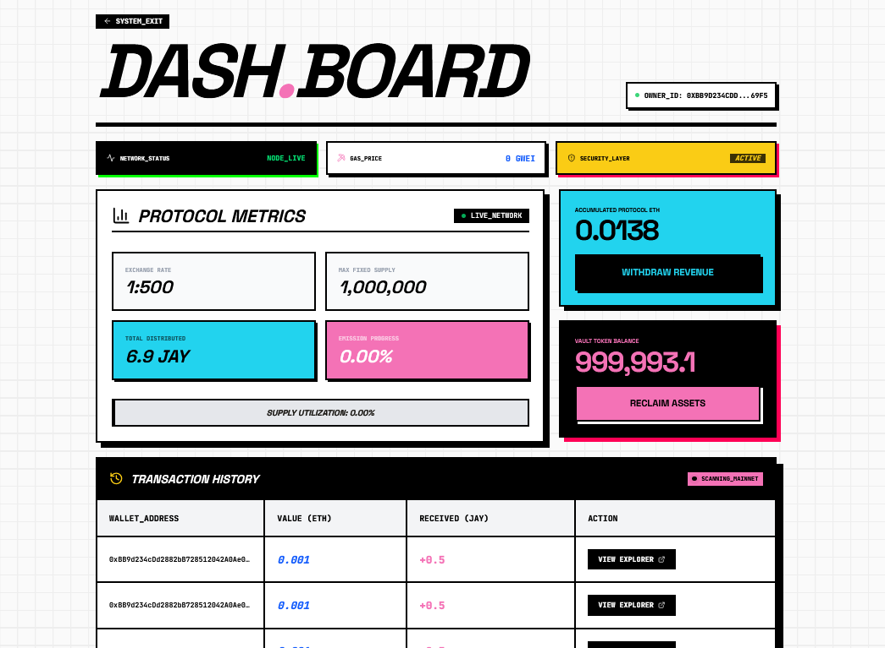
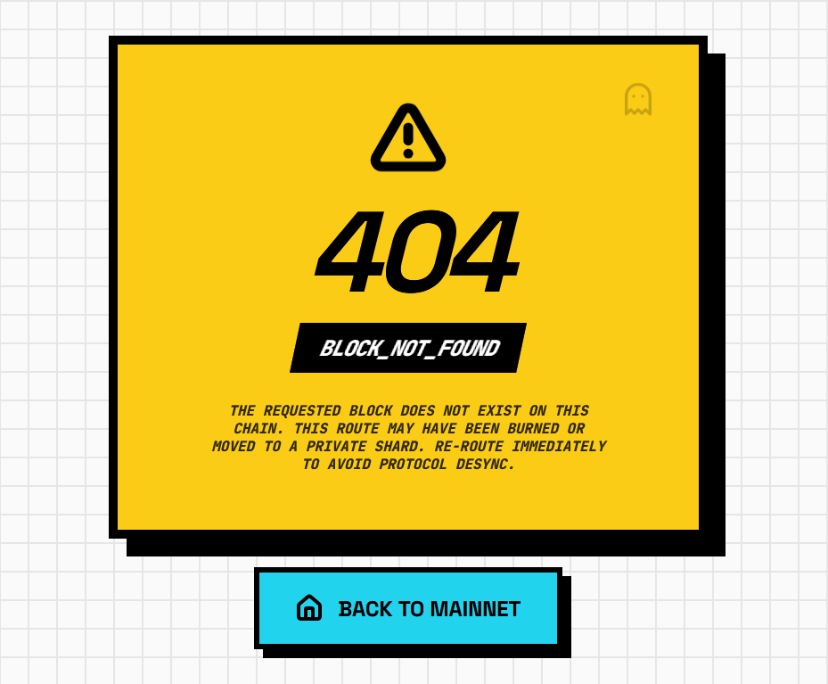

<div align="center">
  
</div>

<h1 align="center"><b>JAY Protocol - Interface</b></h1>

<div align="center">
  
</div>

<br />

<div align="center">
  <a href="YOUR_VERCEL_LINK_HERE" target="_blank">
    
  </a>
</div>

<br />

<div align="center">
  <a href="https://nextjs.org"></a> &nbsp;
  <a href="https://tailwindcss.com"></a> &nbsp;
  <a href="https://docs.ethers.io/v6"></a> &nbsp;
  <a href="https://vercel.com"></a>
</div>

---

## 🎨 Neobrutalist UI Showcase

> *Experience the raw, high-contrast, and bold Neobrutalist design language integrated with seamless Web3 interactions.*

| Zero-Fee Token Swap Engine | Admin Vault & Protocol Metrics |
| :---: | :---: |
|  |  |
| **Homepage & Contract Verification** | **Custom 404 Error Page** |
|  |  |

---

## Project Overview

“JAY Protocol – Interface” is the frontend for the $JAY Protocol dApp.  
Built on Next.js 16 (App Router) with Tailwind CSS and Ethers.js v6, the UI
embraces a Neo‑Brutalist design language: high‑contrast palettes, thick black
borders, and brutal flat shadows. The experience is engineered to feel raw,
instantaneous and completely free – every swap carries **zero fees**.

---

## Comprehensive Feature List

### User Features

- **Zero‑fee Token Swap Engine** Fully client‑side swap interface (`src/components/web3/SwapToken.js`) with
  ETH↔$JAY conversions via the Vendor contract. Mode toggle, gas‑reserve logic,
  and toasts for every lifecycle event.

- **One‑click “Add $JAY to MetaMask”** Navbar button uses `wallet_watchAsset` to push the token metadata straight into
  the user’s wallet.

- **Live Stats Section** Displays total fixed supply and network status. Includes link to
  [Sepolia Etherscan](https://sepolia.etherscan.io) using
  `JAY_TOKEN_ADDRESS` constant for quick verification.

- **Custom Neobrutalist 404 Page** Stylized error screen (`src/app/not-found.js`) warns of missing blocks with
  bold typography and a “Back to Mainnet” button.

### Advanced Web3 Data Integration

- **Global Transaction Feed** Etherscan API call (see `TransactionHistory.js`) to fetch the latest protocol
  activity.

- **User‑Specific Transaction History** On‑chain lookup filtered by the connected wallet address; renders rows with
  hashes and external links.

- **Live Protocol Metrics & Network Indicators** Admin dashboard shows token rate, total supply, tokens sold, real‑time gas
  price (via `provider.getFeeData()`), and a “Live_Network” indicator.

- **Skeleton Loaders & Sonner Toasts** UX helpers for async operations; skeleton components appear during fetches and
  `sonner` toasts provide rich, linked notifications for approvals, swaps, and
  withdrawals.

### Admin Vault & Security Layer

- **Admin Dashboard** (`src/app/admin/page.js`)  
  Authenticated owner interface guarded by wallet address check. Features
  “Withdraw ETH” and “Withdraw Tokens” actions that call vendor contract
  methods with transaction toasts and error handling.

- **Security Layer** Conditional rendering prevents non‑owners from accessing admin pages and
  displays an “ACCESS DENIED” screen with stylized alerts.

### Robust Custom Hook

- **`useWeb3`** (`src/hooks/useWeb3.js`)  
  Encapsulates wallet connection, account/chain state, and network enforcement.

  - Detects `window.ethereum` and requests accounts.
  - Automatically switches/ adds Sepolia (`0xaa36a7`) using
    `wallet_switchEthereumChain` and handles errors.
  - Exposes `account`, `chainId`, and `connectWallet` for components.
  - Provides helper `switchToSepolia` with toast feedback on failures.

---

## Under the Hood (Architecture)

The codebase is modular and client‑centric:

- **App Folder (`src/app/`)** Root layout with global styles, metadata and a global `<Toaster />`. Home and
  admin pages import composable UI/web3 components.

- **Components** Split into `layout`, `ui`, `web3`, and `admin` directories. Each component
  follows the neo‑brutalist CSS conventions (Tailwind utilities).

- **Constants & Contracts** All addresses and ABIs live in `src/constants/index.js` (e.g.
  `JAY_TOKEN_ADDRESS`, `VENDOR_ADDRESS`, `VendorABI`, `JayTokenABI`).

- **Web3 Helpers** `getReadProvider()` utility in `SwapToken.js` and repeated provider/signer
  instantiation patterns ensure DRY integration.

---

## Quick Start / Local Development

```bash
# clone the repository
git clone [https://github.com/](https://github.com/)<your-org>/jay-token-dapps.git
cd jay-token-dapps

# install dependencies
npm install
# or yarn / pnpm / bun

# create .env.local
cat <<EOF > .env.local
NEXT_PUBLIC_ETHERSCAN_API_KEY=your_etherscan_key
NEXT_PUBLIC_VENDOR_ADDRESS=0x...
NEXT_PUBLIC_JAY_TOKEN_ADDRESS=0x...
# add any other NEXT_PUBLIC_* variables required by constants.js
EOF

# run development server
npm run dev
# visit http://localhost:3000
```

---

## 👨‍💻 About Me

Developed by **Zaidan**.  
I am an active Information Technology student at Institut Teknologi Indonesia (ITI) with a solid foundation in programming, system administration, and general IT problem-solving. I am currently looking for part-time opportunities to apply my technical skills.

- **GitHub:** [@MuhammadZaidan1](https://github.com/MuhammadZaidan1)
- **LinkedIn:** [muhammad zaidan](https://www.linkedin.com/in/muhammad-zaidan-046872336/)
- **Email:** muhammadzaidanf123@gmail.com